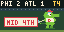

# Retro Phillies — beta

An animated **64×32 Phillies game companion for Tronbyt**: pitches in a strike zone, batter and runner views, illustrative hit animations, scoring runners, a final-score celebration, and a pixel-art Phanatic towing MID/END inning banners.

Created by [cdadamo](https://github.com/cdadamo) with OpenAI Codex. Independent fan project; not affiliated with MLB, the Phillies, OpenAI, Tidbyt, or Tronbyt. Phillies-only for this beta.



**A companion service is required.** Installing the catalog/custom app alone shows setup instructions. The companion fetches public MLB game data and maintains playback state. It does not read your Tronbyt database, need API keys, or control your displays. Your working Tronbyt server still renders and delivers the images.

## Install the companion

Requires a self-hosted Tronbyt server and Docker Compose. The standard example works when Tronbyt is a Docker container on the same Docker host. Hosted servers you cannot administer are not supported. Native 128×64 artwork is not included; this release targets 64×32 displays.

1. Download/clone this repository on your Tronbyt server and open its directory.
2. Run `docker compose up -d --build`.
3. Join your existing Tronbyt container to the companion's network:

   ```sh
   docker network connect retro-phillies YOUR_TRONBYT_CONTAINER_NAME
   ```

   Replace the name with the container running your existing server. This adds an internal Docker network connection; it does not publish a port to the LAN or internet. For a persistent setup, also declare the external `retro-phillies` network on the Tronbyt service in its own Compose configuration. Otherwise repeat the connect command if you recreate the Tronbyt container. Ordinary container restarts retain it.
4. Check `docker compose logs --tail 30` and `docker compose ps`.

The service runs without root, with a read-only filesystem and no mounted user data. It uses at most half a CPU and 192 MiB. It needs outbound HTTPS access to `statsapi.mlb.com`. Do not expose port 8767 publicly; there is no authentication because it serves public baseball data inside the private Docker network.

For testing without Docker, Python 3.9+ with system timezone data can run `BIND_ADDRESS=127.0.0.1 python3 companion/server.py`. Point Pixlet on that same host to `http://127.0.0.1:8767`. A container's localhost is not its host's localhost.

## Install the app

While catalog review is pending, install `apps/retrophillies` using Tronbyt's custom-app support. Once accepted into the catalog, search for **Retro Phillies** there. This repository existing does **not** mean the catalog submission has been accepted.

Set:

- **Companion URL:** `http://retro-phillies:8767`
- **Display ID:** a unique short name for each physical display, such as `desk` (letters, digits, hyphen, underscore).
- **App role:** Normal rotation.
- **Phanatic inning breaks:** On, or turn off if preferred.
- Tronbyt **Render Interval Minutes:** 0. **Display Time:** 10 seconds. **Autopin:** Off.

The display refreshes on its normal requests; five-second upstream polling is not five-second end-to-end latency. Keep the display time at 10 seconds for the animation loop.

### Optional game focus

Install a second copy on the same display, with the **same Companion URL and Display ID**. Set its role to **Postseason focus** (the original setup's preference) or **All-game focus**, render interval 0, display time 10, and **Autopin On**. Keep Autopin off on the normal rotation copy. Disable this focus copy to stop takeovers.

Focus holds through inning breaks and observed game delays, and for 15 minutes after an observed live-to-final transition. It has a six-hour bound from scheduled start. Existing sleeping/manual-pin settings and Tronbyt's own behavior still apply. Render/network failures can cause generic Autopin to release; this beta does not promise uninterrupted coverage.

## What the animations mean

Pitch markers use reported coordinates where available; missing coordinates are not invented. Ball/strike calls come from MLB. Field motion and runners are illustrative, not tracked trajectories or a video replay. Large coalesced updates, scoring revisions, outages, and refresh timing can skip or delay events. Completed hit/scoring sequences have a bounded queue. Restarting baselines past plays rather than replaying old celebrations.

The Phanatic appears after the last play animation finishes while the feed reports three outs. It returns to the batter view after the half-inning changes. Game selection follows live Phillies games, a short final hold, then the next scheduled game. It can fall back to a recent final when no upcoming game is in the three-day schedule window.

## Testing and status

The original home deployment was reviewed on physical Pi/Tidbyt hardware during a Phillies game on September 29, 2026. This extracted package adds independent display playback and configurable connection settings. Its companion and renderer are tested locally; a clean Docker installation on a second user's server has **not** yet been verified. Please treat it as a beta.

```sh
python3 -m unittest discover -s companion -p 'test_*.py'
pixlet format apps/retrophillies/retro_phillies.star
pixlet check apps/retrophillies
```

Public MLB fixture data in `companion/fixtures` supports replay regression tests. It is not a promise of feed availability or licensing rights for redistribution of MLB data. Code is Apache-2.0; third-party names and mascot identity remain their owners' property.

## Bugs and feedback

[Open an issue](https://github.com/cdadamo/retro-phillies/issues/new/choose). Include the game/date, inning and play, expected/observed behavior, server version, and a photo/video if helpful. Do not post API keys, passwords, private addresses, or logs containing them.

## Remove

Disable/remove both app copies and unpin if necessary, then run `docker compose down` in this repository. If you added a persistent network entry to your Tronbyt Compose file, remove that entry as well. No existing apps or device settings are otherwise changed by this package.
